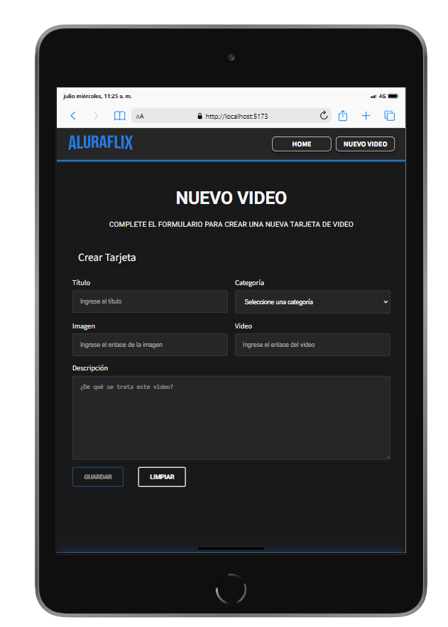
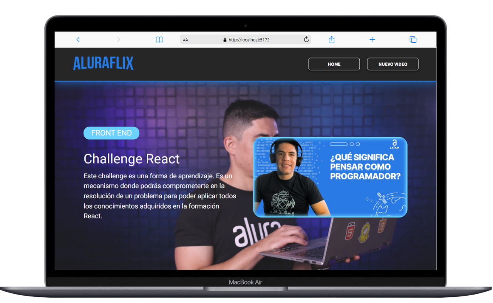

---

# ALURAFLIX

ALURAFLIX es una aplicación de gestión de videos similar a una plataforma de streaming. Permite a los usuarios agregar, listar y gestionar videos categorizados. Este proyecto está construido con React y utiliza json-server para el backend.

## Características

- **Agregar Video**: Permite a los usuarios añadir un nuevo video con título, categoría, imagen, enlace del video y descripción.
- **Listar Videos**: Muestra los videos agregados divididos en categorías.
- **CRUD**: Funcionalidades completas de Crear, Leer, Actualizar y Borrar videos.
- **Responsive**: Diseño adaptable a diferentes tamaños de pantalla.
- **json-server**: Utilizado para simular un backend con una base de datos JSON.
- **Metodología BEM**: Utilizada para mantener un código CSS limpio, escalable y mantenible.

## Tecnologías Utilizadas

- **React**: Biblioteca de JavaScript para construir interfaces de usuario.
- **Vite**: Herramienta de construcción rápida para proyectos de frontend.
- **json-server**: Herramienta para crear un servidor REST API simulado basado en un archivo JSON.
- **CSS Modules**: Estilos encapsulados y organizados para componentes.
- **React Router**: Manejo de rutas en la aplicación.

## Instalación

1. Clona el repositorio:

   ```bash
   git clone https://github.com/Antonio-M94/alura-flix.git
   cd alura-flix
   ```

2. Instala las dependencias:

   ```bash
   npm install
   ```

3. Inicia el servidor json-server y la aplicación React:

   ```bash
   npm run server
   npm run dev
   ```

4. Abre tu navegador y ve a `http://localhost:3000`.

## Uso

### Agregar un Nuevo Video

1. Navega a la página de **Nuevo Video**.
2. Completa el formulario con el título, categoría, enlace de la imagen, enlace del video y descripción.
3. Haz clic en el botón **Guardar**.

### Listar Videos

1. La página principal muestra los videos agrupados por categoría.
2. Puedes hacer clic en los videos para reproducirlos.

## Scripts

En el archivo `package.json`, se han definido los siguientes scripts:

- `dev`: Inicia la aplicación en modo de desarrollo usando Vite.
- `build`: Construye la aplicación para producción usando Vite.
- `lint`: Ejecuta ESLint para analizar el código y asegurarse de que sigue las reglas definidas.
- `preview`: Previsualiza la aplicación construida.
- `server`: Inicia json-server para servir la base de datos JSON en el puerto 3000.

## Estilos

- El proyecto utiliza CSS Modules para mantener los estilos encapsulados y organizados por componente.
- Utiliza la metodología BEM para mantener el código CSS limpio y escalable.

## Capturas de Pantalla

### Móvil


### Tableta



### Escritorio



## Autor

Creado por Isidro Mondragón.

---
